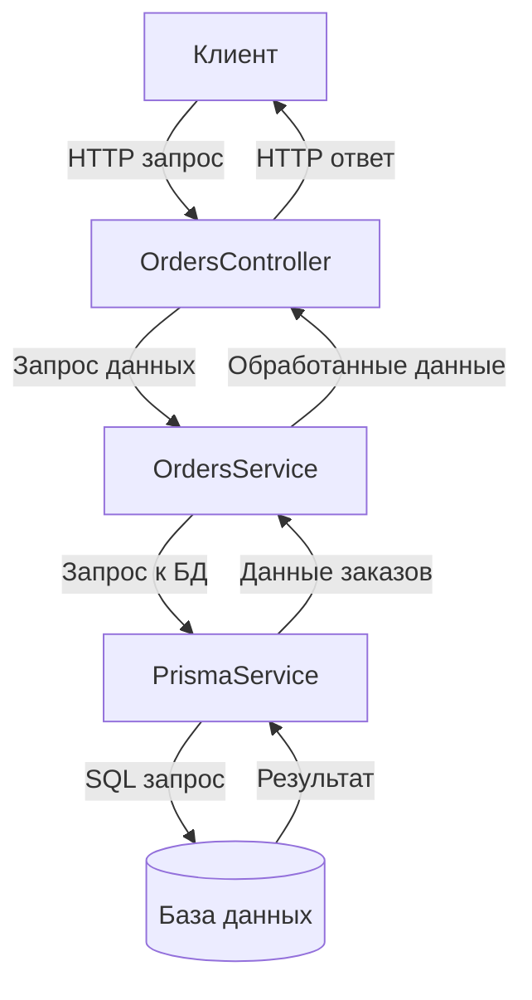
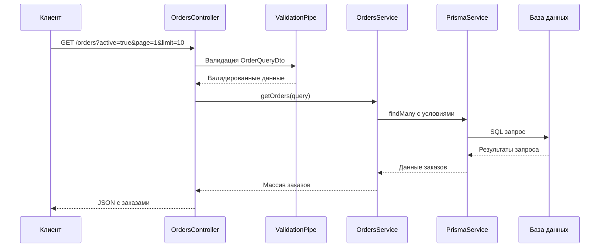
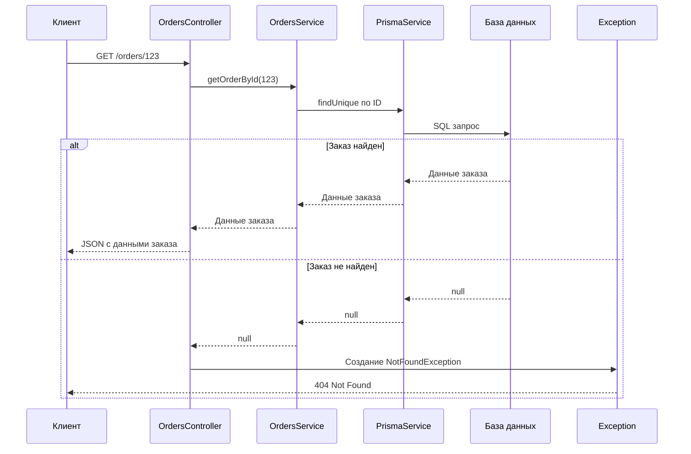

# Руководство по модулю заказов (Orders)

## Содержание

1. [Введение и обзор модуля](#1-введение-и-обзор-модуля)
2. [Архитектура модуля](#2-архитектура-модуля)
   - [Структура каталогов](#21-структура-каталогов)
   - [Принципы архитектуры](#22-принципы-архитектуры)
   - [Схема взаимодействия компонентов](#23-схема-взаимодействия-компонентов)
3. [Базовые компоненты](#3-базовые-компоненты)
   - [Модуль заказов: orders.module.ts](#31-модуль-заказов-ordersmodulets)
   - [Контроллер заказов: orders.controller.ts](#32-контроллер-заказов-orderscontrollerts)
   - [Сервис заказов: orders.service.ts](#33-сервис-заказов-ordersservicets)
   - [DTO для запросов: order-query.dto.ts](#34-dto-для-запросов-order-querydtots)
4. [Модель данных](#4-модель-данных)
   - [Структура заказа (ProductionOrder)](#41-структура-заказа-productionorder)
   - [Связи с другими сущностями](#42-связи-с-другими-сущностями)
5. [Основные операции с заказами](#5-основные-операции-с-заказами)
   - [Получение списка заказов](#51-получение-списка-заказов)
   - [Получение заказа по ID](#52-получение-заказа-по-id)
6. [Процессы и потоки данных](#6-процессы-и-потоки-данных)
   - [Процесс получения списка заказов](#61-процесс-получения-списка-заказов)
   - [Процесс получения информации о заказе](#62-процесс-получения-информации-о-заказе)
7. [Примеры использования](#7-примеры-использования)
   - [Получение активных заказов](#71-получение-активных-заказов)
   - [Получение завершенных заказов](#72-получение-завершенных-заказов)
   - [Получение детальной информации о заказе](#73-получение-детальной-информации-о-заказе)
8. [Руководство по расширению функциональности](#8-руководство-по-расширению-функциональности)
   - [Добавление создания заказов](#81-добавление-создания-заказов)
   - [Добавление обновления статуса заказа](#82-добавление-обновления-статуса-заказа)
   - [Добавление удаления заказа](#83-добавление-удаления-заказа)
   - [Добавление фильтрации и сортировки](#84-добавление-фильтрации-и-сортировки)
9. [Интеграция с другими модулями](#9-интеграция-с-другими-модулями)
   - [Взаимодействие с модулем пользователей](#91-взаимодействие-с-модулем-пользователей)
   - [Взаимодействие с модулем аутентификации](#92-взаимодействие-с-модулем-аутентификации)
10. [Часто задаваемые вопросы](#10-часто-задаваемые-вопросы)

---

## 1. Введение и обзор модуля

Модуль заказов (Orders) представляет собой компонент системы, предназначенный для управления производственными заказами. Он обеспечивает следующую функциональность:

- **Получение списка заказов**: с возможностью фильтрации активных/завершенных заказов и пагинацией
- **Получение детальной информации о заказе**: по его идентификатору

В текущей реализации модуль предоставляет только возможности чтения данных. Функциональность создания, изменения и удаления заказов может быть добавлена в будущем.

Модуль Orders взаимодействует с базой данных через Prisma ORM и предоставляет API для работы с данными о заказах в формате REST.

---

## 2. Архитектура модуля

### 2.1 Структура каталогов

```
src/modules/orders/
├── controllers/               # Обработчики HTTP-запросов
│   └── orders.controller.ts   # Контроллер для обработки запросов к заказам
│
├── dto/                       # Объекты передачи данных
│   └── order-query.dto.ts     # DTO для параметров запроса списка заказов
│
├── entities/                  # Определения сущностей (при необходимости)
│
├── services/                  # Бизнес-логика
│   └── orders.service.ts      # Сервис для работы с заказами
│
└── orders.module.ts           # Определение модуля Orders
```

### 2.2 Принципы архитектуры

Модуль Orders следует тем же архитектурным принципам, что и другие модули системы:

1. **Многослойная архитектура**:
   - **Контроллеры** - принимают HTTP-запросы и передают данные сервисам
   - **Сервисы** - содержат бизнес-логику и взаимодействуют с базой данных через Prisma
   - **DTOs** - определяют структуры данных для валидации входных параметров

2. **Dependency Injection (DI)**:
   - Все зависимости (например, PrismaService) внедряются через конструкторы
   - Это упрощает тестирование и поддержку кода

3. **RESTful API**:
   - Следование принципам REST для организации API
   - Использование соответствующих HTTP методов и кодов ответа

### 2.3 Схема взаимодействия компонентов



---

## 3. Базовые компоненты

### 3.1 Модуль заказов: orders.module.ts

**Назначение**: Конфигурирует и объединяет компоненты модуля заказов.

**Код**:
```typescript
import { Module } from '@nestjs/common';
import { OrdersController } from './controllers/orders.controller';
import { OrdersService } from './services/orders.service';
import { SharedModule } from '../../shared/shared.module';

@Module({
  imports: [SharedModule],
  controllers: [OrdersController],
  providers: [OrdersService],
})
export class OrdersModule {}
```

**Как работает**:
1. Импортирует `SharedModule` для доступа к общим сервисам (в том числе PrismaService)
2. Регистрирует `OrdersController` для обработки HTTP-запросов
3. Регистрирует `OrdersService` для выполнения бизнес-логики
4. Не экспортирует сервисы, так как они не используются другими модулями

### 3.2 Контроллер заказов: orders.controller.ts

**Назначение**: Обрабатывает HTTP-запросы для работы с заказами.

**Код**:
```typescript
import { Controller, Get, Param, Query, NotFoundException } from '@nestjs/common';
import { OrdersService } from '../services/orders.service';
import { OrderQueryDto } from '../dto/order-query.dto';

@Controller('orders')
export class OrdersController {
  constructor(private readonly ordersService: OrdersService) {}

  // Получение списка заказов
  @Get()
  async getOrders(@Query() query: OrderQueryDto) {
    return await this.ordersService.getOrders(query);
  }

  // Получение заказа по id
  @Get(':id')
  async getOrderById(@Param('id') id: string) {
    const order = await this.ordersService.getOrderById(Number(id));
    if (!order) {
      throw new NotFoundException(`Заказ с id ${id} не найден`);
    }
    return order;
  }
}
```

**Как работает**:
1. Обрабатывает запросы на базовый путь `/orders`
2. Предоставляет два endpoint'а:
   - GET `/orders` - получение списка заказов с параметрами фильтрации и пагинации
   - GET `/orders/:id` - получение заказа по идентификатору
3. Использует декоратор `@Query()` для извлечения параметров запроса
4. Использует декоратор `@Param()` для извлечения параметров пути
5. Выбрасывает исключение `NotFoundException` если заказ не найден
6. Делегирует выполнение операций сервису `OrdersService`

### 3.3 Сервис заказов: orders.service.ts

**Назначение**: Содержит бизнес-логику для работы с заказами.

**Код**:
```typescript
import { Injectable } from '@nestjs/common';
import { PrismaService } from '../../../shared/prisma.service';
import { OrderQueryDto } from '../dto/order-query.dto';

@Injectable()
export class OrdersService {
  constructor(private readonly prisma: PrismaService) {}

  // Получение списка заказов с фильтрами и пагинацией
  async getOrders(query: OrderQueryDto) {
    const { active, page = 1, limit = 10 } = query;
    const whereClause = active !== undefined 
      ? { completed: active ? false : true }
      : {};

    return this.prisma.productionOrder.findMany({
      where: whereClause,
      skip: (page - 1) * limit,
      take: limit,
      orderBy: { createdAt: 'desc' },
    });
  }

  // Получение заказа по id
  async getOrderById(id: number) {
    return this.prisma.productionOrder.findUnique({
      where: { id },
    });
  }
}
```

**Как работает**:
1. Внедряет `PrismaService` для взаимодействия с базой данных
2. Предоставляет два метода:
   - `getOrders` - получение списка заказов с фильтрацией и пагинацией
   - `getOrderById` - получение заказа по идентификатору
3. Формирует условия для выборки на основе параметров запроса
4. Выполняет запросы к базе данных через Prisma ORM
5. Возвращает результаты запросов

### 3.4 DTO для запросов: order-query.dto.ts

**Назначение**: Определяет структуру параметров запроса для получения списка заказов.

**Предполагаемый код**:
```typescript
import { IsOptional, IsBoolean, IsInt, Min, Max, Transform } from 'class-validator';
import { Type } from 'class-transformer';

export class OrderQueryDto {
  @IsOptional()
  @Transform(({ value }) => value === 'true' ? true : value === 'false' ? false : undefined)
  @IsBoolean()
  active?: boolean;

  @IsOptional()
  @Type(() => Number)
  @IsInt()
  @Min(1)
  page?: number;

  @IsOptional()
  @Type(() => Number)
  @IsInt()
  @Min(1)
  @Max(100)
  limit?: number;
}
```

**Как работает**:
1. Определяет три необязательных параметра:
   - `active` - флаг активности заказа (активные/завершенные)
   - `page` - номер страницы для пагинации (по умолчанию 1)
   - `limit` - количество записей на странице (по умолчанию 10)
2. Использует декораторы из `class-validator` для валидации данных
3. Использует `@Transform` для преобразования строковых значений в булевы
4. Использует `class-transformer` для преобразования типов данных

---

## 4. Модель данных

### 4.1 Структура заказа (ProductionOrder)

**Предполагаемая структура** на основе использования в коде:

```prisma
model ProductionOrder {
  id          Int      @id @default(autoincrement())
  orderNumber String   @unique
  description String?
  clientId    Int?
  client      Client?  @relation(fields: [clientId], references: [id])
  completed   Boolean  @default(false)
  createdAt   DateTime @default(now())
  updatedAt   DateTime @updatedAt
  dueDate     DateTime?
  priority    Int?     @default(1)
  items       OrderItem[]
  // Другие поля...
}

model OrderItem {
  id         Int      @id @default(autoincrement())
  orderId    Int
  order      ProductionOrder @relation(fields: [orderId], references: [id])
  productId  Int
  product    Product  @relation(fields: [productId], references: [id])
  quantity   Int
  unitPrice  Float?
  // Другие поля...
}
```

### 4.2 Связи с другими сущностями

Модель `ProductionOrder` предположительно имеет следующие связи:

1. **Связь с клиентом** (Client): каждый заказ связан с определенным клиентом
2. **Связь с элементами заказа** (OrderItem): один заказ может содержать множество позиций
3. **Связь с продуктами** (Product): через OrderItem заказ связан с продуктами

---

## 5. Основные операции с заказами

### 5.1 Получение списка заказов

**Endpoint**: `GET /orders`

**Параметры запроса**:
- `active` (необязательный): фильтр по статусу (активные/завершенные)
- `page` (необязательный): номер страницы (по умолчанию 1)
- `limit` (необязательный): количество записей на странице (по умолчанию 10)

**Что делает**:
1. Проверяет и валидирует параметры запроса через OrderQueryDto
2. Формирует условия фильтрации на основе параметра `active`:
   - Если `active=true`, выбираются заказы с `completed=false`
   - Если `active=false`, выбираются заказы с `completed=true`
   - Если `active` не указан, выбираются все заказы
3. Применяет пагинацию с помощью параметров `page` и `limit`
4. Сортирует результаты по дате создания (от новых к старым)
5. Возвращает результаты в формате JSON

**Пример ответа**:
```json
[
  {
    "id": 123,
    "orderNumber": "ORD-2023-123",
    "description": "Заказ на изготовление металлических деталей",
    "completed": false,
    "createdAt": "2023-06-15T10:30:00Z",
    "updatedAt": "2023-06-15T15:45:00Z",
    "dueDate": "2023-07-01T00:00:00Z",
    "priority": 2
  },
  // ...другие заказы
]
```

### 5.2 Получение заказа по ID

**Endpoint**: `GET /orders/:id`

**Параметры пути**:
- `id`: идентификатор заказа

**Что делает**:
1. Извлекает идентификатор заказа из URL
2. Преобразует строковый идентификатор в число
3. Ищет заказ в базе данных по идентификатору
4. Если заказ не найден, возвращает ошибку 404 (Not Found)
5. Если заказ найден, возвращает его данные в формате JSON

**Пример ответа**:
```json
{
  "id": 123,
  "orderNumber": "ORD-2023-123",
  "description": "Заказ на изготовление металлических деталей",
  "completed": false,
  "createdAt": "2023-06-15T10:30:00Z",
  "updatedAt": "2023-06-15T15:45:00Z",
  "dueDate": "2023-07-01T00:00:00Z",
  "priority": 2,
  "clientId": 45
}
```

---

## 6. Процессы и потоки данных

### 6.1 Процесс получения списка заказов

**Шаги процесса**:

1. **Клиент отправляет запрос на получение заказов**:
   ```http
   GET /orders?active=true&page=1&limit=10
   ```

2. **NestJS обрабатывает запрос**:
   - Маршрутизирует запрос к `OrdersController`
   - Преобразует query-параметры в объект `OrderQueryDto`
   - Валидирует параметры (если указаны)

3. **Контроллер делегирует обработку запроса сервису**:
   - Вызывает метод `ordersService.getOrders(query)`

4. **Сервис формирует и выполняет запрос к базе данных**:
   - Формирует условия фильтрации на основе параметра `active`
   - Вычисляет параметры пагинации (`skip` и `take`)
   - Выполняет запрос к базе данных через Prisma

5. **База данных возвращает результаты**:
   - Выполняется SQL-запрос
   - Результаты преобразуются в объекты JavaScript

6. **Сервис возвращает данные контроллеру, а контроллер - клиенту**:
   - Данные автоматически сериализуются в JSON
   - Клиент получает ответ с кодом 200 (OK) и данными заказов

**Диаграмма процесса**:


### 6.2 Процесс получения информации о заказе

**Шаги процесса**:

1. **Клиент отправляет запрос на получение информации о заказе**:
   ```http
   GET /orders/123
   ```

2. **NestJS обрабатывает запрос**:
   - Маршрутизирует запрос к методу `getOrderById` в `OrdersController`
   - Извлекает параметр `id` из URL

3. **Контроллер делегирует обработку запроса сервису**:
   - Преобразует `id` из строки в число
   - Вызывает метод `ordersService.getOrderById(id)`

4. **Сервис выполняет запрос к базе данных**:
   - Выполняет `findUnique` через Prisma для поиска заказа по ID

5. **Сервис возвращает результат контроллеру**:
   - Если заказ найден, возвращает его данные
   - Если заказ не найден, возвращает `null`

6. **Контроллер обрабатывает результат**:
   - Если заказ не найден, выбрасывает исключение `NotFoundException`
   - Если заказ найден, возвращает его клиенту

7. **Клиент получает ответ**:
   - В случае успеха - код 200 (OK) и данные заказа
   - В случае отсутствия заказа - код 404 (Not Found) и сообщение об ошибке

**Диаграмма процесса**:


---

## 7. Примеры использования

### 7.1 Получение активных заказов

**Запрос**:
```bash
curl -X GET "http://localhost:3000/orders?active=true&page=1&limit=10"
```

**Успешный ответ**:
```json
[
  {
    "id": 123,
    "orderNumber": "ORD-2023-123",
    "description": "Заказ на изготовление металлических деталей",
    "completed": false,
    "createdAt": "2023-06-15T10:30:00Z",
    "dueDate": "2023-07-01T00:00:00Z",
    "priority": 2
  },
  {
    "id": 124,
    "orderNumber": "ORD-2023-124",
    "description": "Заказ на изготовление пластиковых форм",
    "completed": false,
    "createdAt": "2023-06-16T09:00:00Z",
    "dueDate": "2023-07-05T00:00:00Z",
    "priority": 1
  }
]
```

### 7.2 Получение завершенных заказов

**Запрос**:
```bash
curl -X GET "http://localhost:3000/orders?active=false&page=1&limit=10"
```

**Успешный ответ**:
```json
[
  {
    "id": 121,
    "orderNumber": "ORD-2023-121",
    "description": "Заказ на изготовление алюминиевых профилей",
    "completed": true,
    "createdAt": "2023-06-10T08:15:00Z",
    "dueDate": "2023-06-25T00:00:00Z",
    "priority": 1
  },
  {
    "id": 122,
    "orderNumber": "ORD-2023-122",
    "description": "Заказ на обработку стальных деталей",
    "completed": true,
    "createdAt": "2023-06-12T14:20:00Z",
    "dueDate": "2023-06-30T00:00:00Z",
    "priority": 3
  }
]
```

### 7.3 Получение детальной информации о заказе

**Запрос**:
```bash
curl -X GET "http://localhost:3000/orders/123"
```

**Успешный ответ**:
```json
{
  "id": 123,
  "orderNumber": "ORD-2023-123",
  "description": "Заказ на изготовление металлических деталей",
  "clientId": 45,
  "completed": false,
  "createdAt": "2023-06-15T10:30:00Z",
  "updatedAt": "2023-06-15T15:45:00Z",
  "dueDate": "2023-07-01T00:00:00Z",
  "priority": 2
}
```

**Ошибка (заказ не найден)**:
```json
{
  "statusCode": 404,
  "message": "Заказ с id 999 не найден",
  "error": "Not Found"
}
```

---

## 8. Руководство по расширению функциональности

### 8.1 Добавление создания заказов

Для добавления возможности создания заказов нужно:

1. **Создать DTO для создания заказа**:
```typescript
// src/modules/orders/dto/create-order.dto.ts
import { IsNotEmpty, IsString, IsOptional, IsInt, IsDateString, Min, Max } from 'class-validator';

export class CreateOrderDto {
  @IsNotEmpty()
  @IsString()
  orderNumber: string;

  @IsOptional()
  @IsString()
  description?: string;

  @IsOptional()
  @IsInt()
  clientId?: number;

  @IsOptional()
  @IsDateString()
  dueDate?: string;

  @IsOptional()
  @IsInt()
  @Min(1)
  @Max(5)
  priority?: number;
}
```

2. **Добавить метод в сервис**:
```typescript
// src/modules/orders/services/orders.service.ts
async createOrder(dto: CreateOrderDto) {
  // Проверка уникальности orderNumber
  const existingOrder = await this.prisma.productionOrder.findUnique({
    where: { orderNumber: dto.orderNumber },
  });
  
  if (existingOrder) {
    throw new ConflictException(`Заказ с номером ${dto.orderNumber} уже существует`);
  }
  
  // Создание заказа
  return this.prisma.productionOrder.create({
    data: {
      orderNumber: dto.orderNumber,
      description: dto.description,
      clientId: dto.clientId,
      dueDate: dto.dueDate ? new Date(dto.dueDate) : undefined,
      priority: dto.priority,
      // По умолчанию заказ не завершен
      completed: false,
    },
  });
}
```

3. **Добавить endpoint в контроллер**:
```typescript
// src/modules/orders/controllers/orders.controller.ts
@Post()
@UseGuards(JwtAuthGuard)
@Roles(RoleEnum.ADMIN, RoleEnum.MANAGER)
async createOrder(@Body() createOrderDto: CreateOrderDto) {
  return await this.ordersService.createOrder(createOrderDto);
}
```

4. **Импортировать необходимые модули и компоненты**:
```typescript
import { JwtAuthGuard } from '../../auth/guards/jwt-auth.guard';
import { Roles } from '../../../common/decorators/roles.decorator';
import { RoleEnum } from '../../../common/enums/role.enum';
import { CreateOrderDto } from '../dto/create-order.dto';
import { ConflictException } from '@nestjs/common';
```

### 8.2 Добавление обновления статуса заказа

1. **Создать DTO для обновления статуса**:
```typescript
// src/modules/orders/dto/update-order-status.dto.ts
import { IsBoolean, IsNotEmpty } from 'class-validator';

export class UpdateOrderStatusDto {
  @IsNotEmpty()
  @IsBoolean()
  completed: boolean;
}
```

2. **Добавить метод в сервис**:
```typescript
// src/modules/orders/services/orders.service.ts
async updateOrderStatus(id: number, dto: UpdateOrderStatusDto) {
  const order = await this.prisma.productionOrder.findUnique({
    where: { id },
  });
  
  if (!order) {
    throw new NotFoundException(`Заказ с id ${id} не найден`);
  }
  
  return this.prisma.productionOrder.update({
    where: { id },
    data: { completed: dto.completed },
  });
}
```

3. **Добавить endpoint в контроллер**:
```typescript
// src/modules/orders/controllers/orders.controller.ts

@Patch(':id/status')
@UseGuards(JwtAuthGuard)
@Roles(RoleEnum.ADMIN, RoleEnum.MANAGER)
async updateOrderStatus(
  @Param('id') id: string,
  @Body() updateOrderStatusDto: UpdateOrderStatusDto
) {
  return await this.ordersService.updateOrderStatus(Number(id), updateOrderStatusDto);
}
```

### 8.3 Добавление удаления заказа

1. **Добавить метод в сервис**:
```typescript
// src/modules/orders/services/orders.service.ts
async deleteOrder(id: number) {
  const order = await this.prisma.productionOrder.findUnique({
    where: { id },
  });
  
  if (!order) {
    throw new NotFoundException(`Заказ с id ${id} не найден`);
  }
  
  return this.prisma.productionOrder.delete({
    where: { id },
  });
}
```

2. **Добавить endpoint в контроллер**:
```typescript
// src/modules/orders/controllers/orders.controller.ts
@Delete(':id')
@UseGuards(JwtAuthGuard)
@Roles(RoleEnum.ADMIN)
async deleteOrder(@Param('id') id: string) {
  return await this.ordersService.deleteOrder(Number(id));
}
```

### 8.4 Добавление фильтрации и сортировки

1. **Расширить DTO для запросов**:
```typescript
// src/modules/orders/dto/order-query.dto.ts
import { IsOptional, IsBoolean, IsInt, Min, Max, IsString, IsDateString, IsEnum } from 'class-validator';
import { Type, Transform } from 'class-transformer';

export enum OrderSortField {
  CREATED_AT = 'createdAt',
  DUE_DATE = 'dueDate',
  PRIORITY = 'priority',
  ORDER_NUMBER = 'orderNumber',
}

export enum SortOrder {
  ASC = 'asc',
  DESC = 'desc',
}

export class OrderQueryDto {
  // Существующие поля
  @IsOptional()
  @Transform(({ value }) => value === 'true' ? true : value === 'false' ? false : undefined)
  @IsBoolean()
  active?: boolean;

  @IsOptional()
  @Type(() => Number)
  @IsInt()
  @Min(1)
  page?: number;

  @IsOptional()
  @Type(() => Number)
  @IsInt()
  @Min(1)
  @Max(100)
  limit?: number;
  
  // Новые поля для фильтрации
  @IsOptional()
  @IsString()
  search?: string;
  
  @IsOptional()
  @IsDateString()
  startDate?: string;
  
  @IsOptional()
  @IsDateString()
  endDate?: string;
  
  @IsOptional()
  @Type(() => Number)
  @IsInt()
  priority?: number;
  
  @IsOptional()
  @Type(() => Number)
  @IsInt()
  clientId?: number;
  
  // Поля для сортировки
  @IsOptional()
  @IsEnum(OrderSortField)
  sortBy?: OrderSortField;
  
  @IsOptional()
  @IsEnum(SortOrder)
  sortOrder?: SortOrder;
}
```

2. **Модифицировать метод в сервисе**:
```typescript
// src/modules/orders/services/orders.service.ts
async getOrders(query: OrderQueryDto) {
  const { 
    active, 
    page = 1, 
    limit = 10,
    search,
    startDate,
    endDate,
    priority,
    clientId,
    sortBy = OrderSortField.CREATED_AT,
    sortOrder = SortOrder.DESC
  } = query;

  // Базовые условия
  const whereClause: any = {};
  
  // Фильтр по статусу
  if (active !== undefined) {
    whereClause.completed = active ? false : true;
  }
  
  // Поиск по номеру заказа или описанию
  if (search) {
    whereClause.OR = [
      { orderNumber: { contains: search, mode: 'insensitive' } },
      { description: { contains: search, mode: 'insensitive' } }
    ];
  }
  
  // Фильтр по дате
  if (startDate || endDate) {
    whereClause.createdAt = {};
    if (startDate) {
      whereClause.createdAt.gte = new Date(startDate);
    }
    if (endDate) {
      whereClause.createdAt.lte = new Date(endDate);
    }
  }
  
  // Фильтр по приоритету
  if (priority !== undefined) {
    whereClause.priority = priority;
  }
  
  // Фильтр по клиенту
  if (clientId !== undefined) {
    whereClause.clientId = clientId;
  }
  
  // Формирование сортировки
  const orderBy = { [sortBy]: sortOrder };

  // Выполнение запроса
  const orders = await this.prisma.productionOrder.findMany({
    where: whereClause,
    skip: (page - 1) * limit,
    take: limit,
    orderBy,
  });
  
  // Получение общего количества записей для пагинации
  const total = await this.prisma.productionOrder.count({
    where: whereClause,
  });
  
  // Вычисление количества страниц
  const totalPages = Math.ceil(total / limit);
  
  // Возврат данных с метаинформацией
  return {
    data: orders,
    meta: {
      page,
      limit,
      total,
      totalPages,
    }
  };
}
```

3. **Обновить контроллер для поддержки новых параметров**:
```typescript
// src/modules/orders/controllers/orders.controller.ts
@Get()
async getOrders(@Query() query: OrderQueryDto) {
  return await this.ordersService.getOrders(query);
}
```

---

## 9. Интеграция с другими модулями

### 9.1 Взаимодействие с модулем пользователей

Для связи заказов с пользователями и отслеживания, кто создал или изменил заказ, можно добавить соответствующие поля в модель заказа и реализовать доступ к текущему пользователю.

1. **Добавить поля в схему Prisma**:
```prisma
// prisma/schema.prisma
model ProductionOrder {
  id          Int      @id @default(autoincrement())
  // Существующие поля...
  
  // Поля для отслеживания пользователей
  createdById Int?
  createdBy   User?   @relation("CreatedOrders", fields: [createdById], references: [id])
  updatedById Int?
  updatedBy   User?   @relation("UpdatedOrders", fields: [updatedById], references: [id])
}

model User {
  // Существующие поля...
  
  // Связи с заказами
  createdOrders ProductionOrder[] @relation("CreatedOrders")
  updatedOrders ProductionOrder[] @relation("UpdatedOrders")
}
```

2. **Использовать декоратор CurrentUser для доступа к данным пользователя**:
```typescript
// src/modules/orders/controllers/orders.controller.ts
@Post()
@UseGuards(JwtAuthGuard)
@Roles(RoleEnum.ADMIN, RoleEnum.MANAGER)
async createOrder(
  @Body() createOrderDto: CreateOrderDto,
  @CurrentUser() user: any
) {
  return await this.ordersService.createOrder(createOrderDto, user.id);
}
```

3. **Обновить метод в сервисе**:
```typescript
// src/modules/orders/services/orders.service.ts
async createOrder(dto: CreateOrderDto, userId: number) {
  // Проверка уникальности...
  
  return this.prisma.productionOrder.create({
    data: {
      // Существующие поля...
      createdById: userId,
      updatedById: userId,
    },
  });
}
```

### 9.2 Взаимодействие с модулем аутентификации

Для защиты endpoint'ов модуля Orders авторизацией необходимо:

1. **Импортировать AuthModule в OrdersModule** (если требуется прямое взаимодействие):
```typescript
// src/modules/orders/orders.module.ts
import { Module } from '@nestjs/common';
import { OrdersController } from './controllers/orders.controller';
import { OrdersService } from './services/orders.service';
import { SharedModule } from '../../shared/shared.module';
import { AuthModule } from '../auth/auth.module';

@Module({
  imports: [SharedModule, AuthModule],
  controllers: [OrdersController],
  providers: [OrdersService],
})
export class OrdersModule {}
```

2. **Защитить endpoint'ы с помощью JwtAuthGuard**:
```typescript
// src/modules/orders/controllers/orders.controller.ts
import { JwtAuthGuard } from '../../auth/guards/jwt-auth.guard';
import { Roles } from '../../../common/decorators/roles.decorator';
import { RoleEnum } from '../../../common/enums/role.enum';

@Controller('orders')
export class OrdersController {
  // ...

  @Get()
  @UseGuards(JwtAuthGuard) // Добавляем защиту для получения списка заказов
  async getOrders(@Query() query: OrderQueryDto) {
    return await this.ordersService.getOrders(query);
  }

  @Get(':id')
  @UseGuards(JwtAuthGuard) // Добавляем защиту для получения заказа по ID
  async getOrderById(@Param('id') id: string) {
    const order = await this.ordersService.getOrderById(Number(id));
    if (!order) {
      throw new NotFoundException(`Заказ с id ${id} не найден`);
    }
    return order;
  }
}
```

3. **Настроить роли для доступа к различным действиям**:
```typescript
// Пример разграничения доступа по ролям
@Get()
@UseGuards(JwtAuthGuard, RolesGuard)
@Roles(RoleEnum.ADMIN, RoleEnum.MANAGER, RoleEnum.USER) // Все роли могут просматривать список
async getOrders(@Query() query: OrderQueryDto) {
  return await this.ordersService.getOrders(query);
}

@Post()
@UseGuards(JwtAuthGuard, RolesGuard)
@Roles(RoleEnum.ADMIN, RoleEnum.MANAGER) // Только администраторы и менеджеры могут создавать
async createOrder(@Body() createOrderDto: CreateOrderDto) {
  return await this.ordersService.createOrder(createOrderDto);
}

@Delete(':id')
@UseGuards(JwtAuthGuard, RolesGuard)
@Roles(RoleEnum.ADMIN) // Только администраторы могут удалять
async deleteOrder(@Param('id') id: string) {
  return await this.ordersService.deleteOrder(Number(id));
}
```

---

## 10. Часто задаваемые вопросы

### 10.1 Общие вопросы

**В: Как добавить элементы (товары) в заказ?**

О: Необходимо создать отдельные эндпоинты для управления элементами заказа:

```typescript
// src/modules/orders/controllers/order-items.controller.ts
@Controller('orders/:orderId/items')
export class OrderItemsController {
  constructor(private readonly ordersService: OrdersService) {}

  @Post()
  @UseGuards(JwtAuthGuard, RolesGuard)
  @Roles(RoleEnum.ADMIN, RoleEnum.MANAGER)
  async addItemToOrder(
    @Param('orderId') orderId: string,
    @Body() createOrderItemDto: CreateOrderItemDto
  ) {
    return await this.ordersService.addItemToOrder(Number(orderId), createOrderItemDto);
  }
  
  // Другие методы для управления элементами заказа
}
```

**В: Как реализовать логику изменения статуса заказа при выполнении всех его элементов?**

О: Можно добавить в `OrdersService` метод, который будет вызываться при изменении статуса элемента заказа:

```typescript
async updateOrderItemStatus(orderItemId: number, completed: boolean) {
  // Обновляем статус элемента заказа
  const orderItem = await this.prisma.orderItem.update({
    where: { id: orderItemId },
    data: { completed },
    include: { order: true },
  });
  
  // Проверяем, все ли элементы заказа выполнены
  const allItems = await this.prisma.orderItem.findMany({
    where: { orderId: orderItem.orderId },
  });
  
  const allCompleted = allItems.every(item => item.completed);
  
  // Если все элементы выполнены, обновляем статус заказа
  if (allCompleted) {
    await this.prisma.productionOrder.update({
      where: { id: orderItem.orderId },
      data: { completed: true },
    });
  }
  
  return orderItem;
}
```

**В: Как добавить историю изменений заказа?**

О: Создайте дополнительную модель для отслеживания изменений:

```prisma
// prisma/schema.prisma
model OrderHistory {
  id        Int      @id @default(autoincrement())
  orderId   Int
  order     ProductionOrder @relation(fields: [orderId], references: [id])
  userId    Int?
  user      User?    @relation(fields: [userId], references: [id])
  action    String
  details   String?
  timestamp DateTime @default(now())
}
```

И добавьте логику записи изменений в методы сервиса:

```typescript
async updateOrderStatus(id: number, dto: UpdateOrderStatusDto, userId: number) {
  // Существующая логика обновления статуса...
  
  // Запись в историю
  await this.prisma.orderHistory.create({
    data: {
      orderId: id,
      userId: userId,
      action: 'STATUS_UPDATE',
      details: `Статус изменен на: ${dto.completed ? 'Завершен' : 'Активен'}`,
    },
  });
  
  return updatedOrder;
}
```

### 10.2 Вопросы по ошибкам

**В: Почему возникает ошибка при создании заказа с существующим номером?**

О: В системе реализована проверка уникальности номера заказа. При попытке создать заказ с уже существующим номером будет выброшено исключение `ConflictException`. Убедитесь, что используете уникальный номер заказа.

**В: Как исправить ошибку "Cannot read property 'id' of undefined" при попытке получить заказ?**

О: Эта ошибка возникает, когда пытаются обратиться к свойству объекта, который undefined или null. Возможные причины:

1. Заказ с указанным ID не существует
2. Проблемы с передачей ID (например, передается строка вместо числа)

Решение: добавьте проверку существования заказа перед обращением к его свойствам или используйте optional chaining (`?.`).

**В: Почему не работает фильтрация по дате?**

О: Возможные причины:
1. Даты передаются в неправильном формате (необходим ISO формат, например: "2023-06-15T00:00:00Z")
2. Проблемы с преобразованием строки в объект Date

Решение: убедитесь, что даты передаются в корректном формате и корректно преобразуются в JavaScript Date.

### 10.3 Вопросы по производительности

**В: Как оптимизировать запросы при большом количестве заказов?**

О: Следуйте этим рекомендациям:
1. Всегда используйте пагинацию
2. Добавьте индексы для часто используемых полей фильтрации в схеме Prisma:
   ```prisma
   model ProductionOrder {
     id          Int      @id @default(autoincrement())
     orderNumber String   @unique
     completed   Boolean  @default(false)
     createdAt   DateTime @default(now())
     // Другие поля...
     
     @@index([completed]) // Индекс для поля completed
     @@index([createdAt]) // Индекс для поля createdAt
   }
   ```
3. Выбирайте только необходимые поля при запросе:
   ```typescript
   return this.prisma.productionOrder.findMany({
     select: {
       id: true,
       orderNumber: true,
       description: true,
       // Только нужные поля
     },
     where: whereClause,
     // Другие параметры...
   });
   ```
4. Кэшируйте часто запрашиваемые данные с помощью Redis или другого кэш-решения

**В: Как эффективно загружать данные о связанных сущностях (например, элементах заказа)?**

О: Используйте разные стратегии в зависимости от ситуации:

1. Для отдельного заказа с деталями - используйте `include`:
   ```typescript
   return this.prisma.productionOrder.findUnique({
     where: { id },
     include: {
       items: true,
       client: true,
     },
   });
   ```

2. Для списка заказов - не загружайте связанные данные или загружайте только необходимый минимум:
   ```typescript
   return this.prisma.productionOrder.findMany({
     where: whereClause,
     include: {
       _count: {
         select: {
           items: true, // Только количество элементов
         },
       },
     },
   });
   ```

3. Создайте отдельные эндпоинты для загрузки связанных данных при необходимости

### 10.4 Вопросы по безопасности

**В: Как обеспечить безопасность доступа к заказам разных клиентов?**

О: Реализуйте проверку прав доступа на уровне сервиса:

```typescript
async getOrderById(id: number, userId: number, userRole: string) {
  const order = await this.prisma.productionOrder.findUnique({
    where: { id },
    include: { client: true },
  });
  
  if (!order) {
    throw new NotFoundException(`Заказ с id ${id} не найден`);
  }
  
  // Администратор имеет доступ ко всем заказам
  if (userRole === RoleEnum.ADMIN) {
    return order;
  }
  
  // Менеджер имеет доступ только к заказам клиентов, за которыми он закреплен
  if (userRole === RoleEnum.MANAGER) {
    const managerClients = await this.prisma.clientManager.findMany({
      where: { managerId: userId },
      select: { clientId: true },
    });
    
    const clientIds = managerClients.map(cm => cm.clientId);
    
    if (order.clientId && clientIds.includes(order.clientId)) {
      return order;
    }
  }
  
  // Для других ролей - запрещено
  throw new ForbiddenException('У вас нет доступа к этому заказу');
}
```

**В: Как защититься от инъекций в параметрах запроса?**

О: NestJS и Prisma обеспечивают защиту от SQL-инъекций:
1. Используйте DTOs с валидацией для всех входных данных
2. Не конструируйте SQL-запросы вручную, используйте Prisma API
3. При необходимости дополнительно экранируйте специальные символы в строках поиска

**В: Как защититься от атак перебором id заказов?**

О: Реализуйте следующие меры:
1. Используйте UUID вместо последовательных идентификаторов
2. Ограничивайте количество запросов с одного IP (rate limiting)
3. Требуйте аутентификацию для всех endpoint'ов
4. Логируйте подозрительную активность
